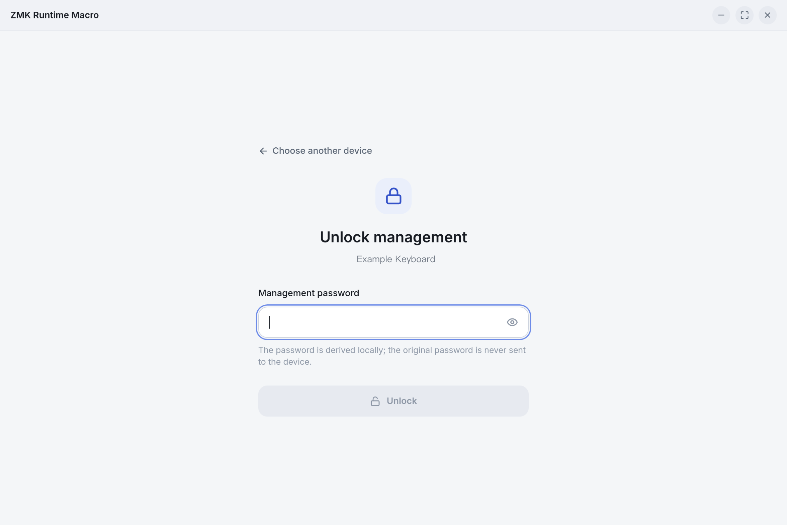
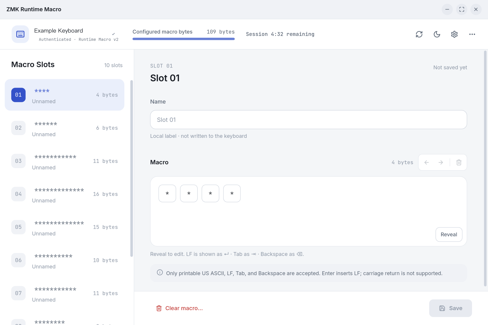

# ZMK Runtime Macro Desktop

A cross-platform desktop GUI for configuring runtime macro slots provided by [`zmk-module-runtime-macro`](https://github.com/leench/zmk-module-runtime-macro).

Supported platforms:

- Linux x86_64
- macOS Intel / Apple Silicon
- Windows x64

## Current status

The current version includes a Tauri 2 + React + TypeScript desktop GUI, Runtime Macro v2 authentication and HID sessions, the MagicPatterns visual design, macro editing, password setup and change flows, authentication-session recovery, and slot privacy previews. The GUI supports Runtime Macro v2 only: it does not provide a Legacy v1 management mode, and passwords are never remembered or persisted.

For the full project constraints, validation boundaries, and release process, see the Chinese documentation:

- [`docs/GUI-DEVELOPMENT.md`](docs/GUI-DEVELOPMENT.md) — GUI development and protocol constraints (中文)
- [`docs/RELEASING.md`](docs/RELEASING.md) — release process and platform packaging (中文)
- [`docs/HARDWARE-VERIFICATION.md`](docs/HARDWARE-VERIFICATION.md) — hardware and platform verification (中文)

## Screenshots

Unlock page:



Macro workbench:



## Development

You need Node.js, Rust, and the Tauri/WebView dependencies for your platform.

```sh
npm install
npm run dev
```

Run the Tauri desktop development app:

```sh
npm run tauri dev
```

Build the frontend:

```sh
npm run build
```

Build desktop bundles:

```sh
npm run tauri build
```

## Related project

The firmware module and shared protocol documentation are maintained in the [`zmk-module-runtime-macro`](https://github.com/leench/zmk-module-runtime-macro) repository. This GUI manages Runtime Macro v2 only, does not provide a Legacy v1 management mode, and does not depend on the Python CLI at runtime.
